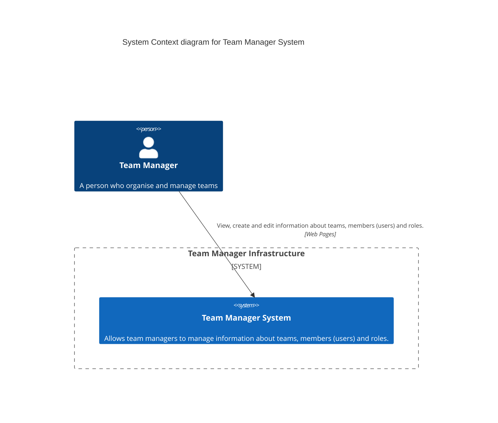
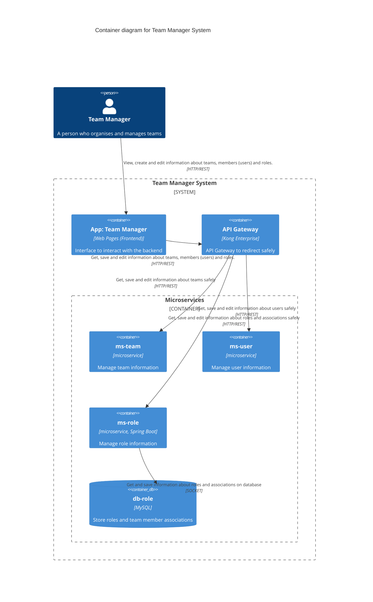
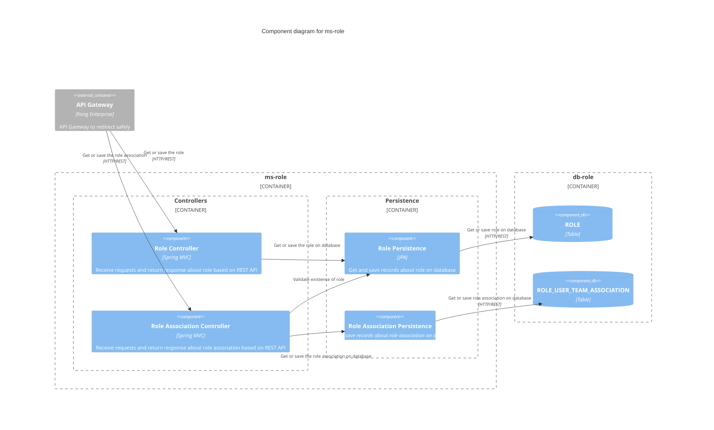

# Process Flow Diagram

## Context Diagram

```mermaid
C4Context
    title System Context diagram for Team Manager System
    Person(TEAM_MANAGER, "Team Manager", "A person who organise and manage teams")
    System_Boundary(INFRA, "Team Manager Infrastructure") {
        System(TEAM_MANAGER_SYSTEM, "Team Manager System", "Allows team managers to manage information about teams, members (users) and roles.")
    }
    Rel(TEAM_MANAGER, TEAM_MANAGER_SYSTEM, "View, create and edit information about teams, members (users) and roles.", "Web Pages")
    UpdateRelStyle(TEAM_MANAGER, TEAM_MANAGER_SYSTEM, $offsetY="-40")
```

## Container Diagram

```mermaid
C4Container
    title Container diagram for Team Manager System
    Person(TEAM_MANAGER, "Team Manager", "A person who organises and manages teams")
    System_Boundary(TEAM_MANAGER_SYSTEM, "Team Manager System") {
        Container(TEAM_MANAGER_APP, "App: Team Manager", "Web Pages (Frontend)", "Interface to interact with the backend")
        Container(API_GATEWAY, "API Gateway", "Kong Enterprise", "API Gateway to redirect safely")
        Container_Boundary(MICROSERVICES, "Microservices") {
            Container(MS_TEAM, "ms-team", "microservice", "Manage team information")
            Container(MS_USER, "ms-user", "microservice", "Manage user information")
            Container(MS_ROLE, "ms-role", "microservice, Spring Boot", "Manage role information")
            ContainerDb(DB_ROLE, "db-role", "MySQL", "Store roles and team member associations")
        }
    }
    Rel(TEAM_MANAGER, TEAM_MANAGER_APP, "View, create and edit information about teams, members (users) and roles.", "HTTP/REST")
    UpdateRelStyle(TEAM_MANAGER, TEAM_MANAGER_APP, $offsetY="-40")
    Rel(TEAM_MANAGER_APP, API_GATEWAY, "Get, save and edit information about teams, members (users) and roles.", "HTTP/REST")
    UpdateRelStyle(TEAM_MANAGER_APP, API_GATEWAY, $offsetY="40", $offsetX="-260")
    Rel(API_GATEWAY, MS_TEAM, "Get, save and edit information about teams safely", "HTTP/REST")
    UpdateRelStyle(API_GATEWAY, MS_TEAM, $offsetY="-40", $offsetX="-220")
    Rel(API_GATEWAY, MS_USER, "Get, save and edit information about users safely", "HTTP/REST")
    UpdateRelStyle(API_GATEWAY, MS_USER, $offsetY="40", $offsetX="-140")
    Rel(API_GATEWAY, MS_ROLE, "Get, save and edit information about roles and associations safely", "HTTP/REST")
    UpdateRelStyle(API_GATEWAY, MS_ROLE, $offsetY="-40", $offsetX="-60")
    Rel(MS_ROLE, DB_ROLE, "Get and save information about roles and associations on database", "SOCKET")
    UpdateRelStyle(MS_ROLE, DB_ROLE, $offsetY="50", $offsetX="-60")
```

## Component Diagram

```mermaid
C4Component
    title Component diagram for ms-role
    Container_Ext(API_GATEWAY, "API Gateway", "Kong Enterprise", "API Gateway to redirect safely")
    Container_Boundary(MS_ROLE, "ms-role") {
        Container_Boundary(CONTROLLERS, "Controllers") {
            Component(ROLE_CONTROLLER, "Role Controller", "Spring MVC", "Receive requests and return response about role based on REST API")
            Component(ASSOCIATION_CONTROLLER, "Role Association Controller", "Spring MVC", "Receive requests and return response about role association based on REST API")
        }
        Container_Boundary(PERSISTENCE, "Persistence") {
            Component(ROLE_PERSISTENCE, "Role Persistence", "JPA", "Get and save records about role on database")
            Component(ASSOCIATION_PERSISTENCE, "Role Association Persistence", "Get and save records about role association on database")
        }
    }
    Container_Boundary(DB, "db-role") {
        ComponentDb(TB_ROLE, "ROLE", "Table")
        ComponentDb(TB_ROLE_USER_TEAM_ASSOCIATION, "ROLE_USER_TEAM_ASSOCIATION", "Table")
    }

    Rel(API_GATEWAY, ROLE_CONTROLLER, "Get or save the role", "HTTP/REST")
    UpdateRelStyle(API_GATEWAY, ROLE_CONTROLLER, $offsetY="-80")
    Rel(API_GATEWAY, ASSOCIATION_CONTROLLER, "Get or save the role association", "HTTP/REST")
    UpdateRelStyle(API_GATEWAY, ASSOCIATION_CONTROLLER, $offsetY="-180", $offsetX="-180")
    Rel(ROLE_PERSISTENCE, TB_ROLE, "Get or save role on database", "HTTP/REST")
    UpdateRelStyle(ROLE_PERSISTENCE, TB_ROLE, $offsetY="-40", $offsetX="-80")
    Rel(ASSOCIATION_PERSISTENCE, TB_ROLE_USER_TEAM_ASSOCIATION, "Get or save role association on database", "HTTP/REST")
    UpdateRelStyle(ASSOCIATION_PERSISTENCE, TB_ROLE_USER_TEAM_ASSOCIATION, $offsetY="-40", $offsetX="-110")

    Rel(ROLE_CONTROLLER, ROLE_PERSISTENCE, "Get or save the role on database")
    UpdateRelStyle(ROLE_CONTROLLER, ROLE_PERSISTENCE, $offsetY="-40", $offsetX="-80")
    Rel(ASSOCIATION_CONTROLLER, ROLE_PERSISTENCE, "Validate existence of role")
    UpdateRelStyle(ASSOCIATION_CONTROLLER, ROLE_PERSISTENCE, $offsetY="-40", $offsetX="-100")
    Rel(ASSOCIATION_CONTROLLER, ASSOCIATION_PERSISTENCE, "Get or save the role association on database")
    UpdateRelStyle(ASSOCIATION_CONTROLLER, ASSOCIATION_PERSISTENCE, $offsetY="60", $offsetX="-100")
```

