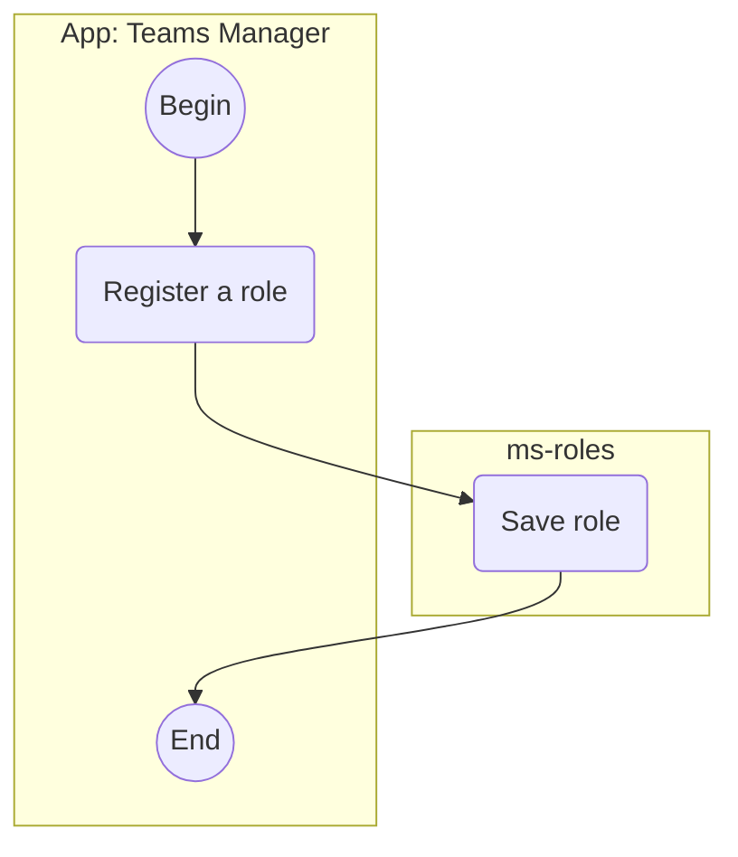
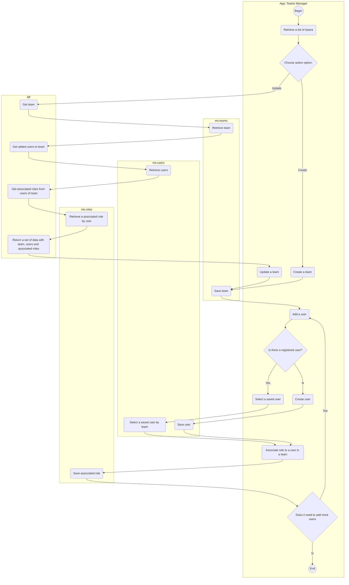

# Process flow diagram

## Creating role

```mermaid
flowchart TB
        
subgraph "ms-roles"
    SAVE_ROLE("Save role")
end
subgraph "App: Teams Manager"
    BEGIN(("Begin"))
    REG_ROLE("Register a role")
    END(("End"))
end

BEGIN-->REG_ROLE
REG_ROLE-->SAVE_ROLE
SAVE_ROLE-->END
```

## Creating team

```mermaid
flowchart TB
        
subgraph "ms-users"
    RETRIEVE_USER_DATA("Retrieve users")
    SELECT_SAVED_USER("Select a saved user by team")
    SAVE_USER("Save user")
end
subgraph "ms-roles"
    RETRIEVE_ASSOCIATED_ROLE_DATA("Retrieve a associated role by user")
    SAVE_ASSOCIATED_ROLE("Save associated role")
end
subgraph "App: Teams Manager"
    BEGIN(("Begin"))
    RETRIEVE_LIST_TEAMS("Retrieve a list of teams")
    CHOOSE_ACTION_OPTION{"Choose action option:"}
    CREATE_TEAM("Create a team")
    UPDATE_TEAM("Update a team")
    ADD_USER("Add a user")
    IS_THERE_USER{"Is there a registered user?"}
    SELECT_USER("Select a saved user")
    CREATE_USER("Create user")
    ASSOCIATE_ROLE("Associate role to a user in a team")
    NEED_ADD_MORE_USERS{"Does it need to add more users"}
    END(("End"))
end
subgraph "ms-teams"
    RETRIEVE_TEAM_DATA("Retrieve team")
    SAVE_TEAM("Save team")
end
subgraph "bff"
    GET_TEAM_DATA("Get team")
    GET_USERS_DATA("Get added users to team")
    GET_ASSOCIATED_ROLES_DATA("Get associated roles from users of team")
    RETURN_TEAM_USERS_ASSOCIATED_ROLES("Return a set of data with team, users and associated roles")
end

BEGIN-->RETRIEVE_LIST_TEAMS
RETRIEVE_LIST_TEAMS-->CHOOSE_ACTION_OPTION

CHOOSE_ACTION_OPTION--Update-->GET_TEAM_DATA

GET_TEAM_DATA-->RETRIEVE_TEAM_DATA
RETRIEVE_TEAM_DATA-->GET_USERS_DATA
GET_USERS_DATA-->RETRIEVE_USER_DATA
RETRIEVE_USER_DATA-->GET_ASSOCIATED_ROLES_DATA
GET_ASSOCIATED_ROLES_DATA-->RETRIEVE_ASSOCIATED_ROLE_DATA
RETRIEVE_ASSOCIATED_ROLE_DATA-->RETURN_TEAM_USERS_ASSOCIATED_ROLES
RETURN_TEAM_USERS_ASSOCIATED_ROLES-->UPDATE_TEAM
UPDATE_TEAM-->SAVE_TEAM

CHOOSE_ACTION_OPTION--Create-->CREATE_TEAM

CREATE_TEAM-->SAVE_TEAM
SAVE_TEAM-->ADD_USER
ADD_USER-->IS_THERE_USER
IS_THERE_USER--Yes--> SELECT_USER
IS_THERE_USER--No-->CREATE_USER

SELECT_USER-->SELECT_SAVED_USER
SELECT_SAVED_USER-->ASSOCIATE_ROLE

CREATE_USER-->SAVE_USER
SAVE_USER-->ASSOCIATE_ROLE

ASSOCIATE_ROLE-->SAVE_ASSOCIATED_ROLE
SAVE_ASSOCIATED_ROLE-->NEED_ADD_MORE_USERS
NEED_ADD_MORE_USERS--Yes-->ADD_USER
NEED_ADD_MORE_USERS--No-->END
```

##  